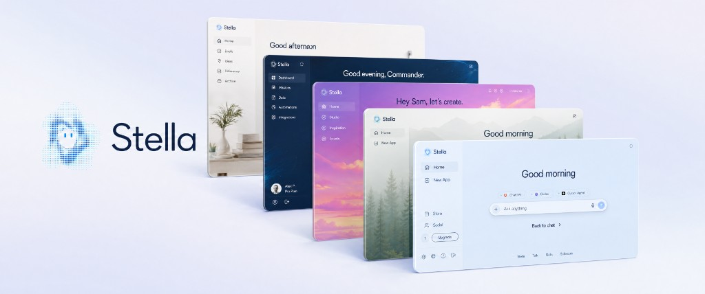

  

  <a href="https://stella.sh">stella.sh</a>

  

The world's first personal software.

Everything can change. UI, functionality, runtime, prompts, skills. No restrictions, no plugin sandbox, no extension store gatekeeping. If Stella is missing something you want, you just ask her to add it.

## One ongoing conversation

There are no new chats and no chat history to manage. You talk to the same Stella every time, and she remembers. When something needs work, she spawns agents in the background and gets back to you.

## Personalized in a few clicks

Onboarding is a couple of buttons. Tell Stella who you are and what you care about, and she takes it from there.

## Open source. Your data stays on your computer.

Stella is fully open source. Your files and your conversations stay on your machine — we don't store them on our servers. Bring any model you already pay for, or use Stella's managed route if you'd rather not set anything up.

## Memory that grows with you

Stella keeps a long-term memory in plain markdown files on your computer, so the longer you use her the better she gets. Two optional background agents keep it healthy:

- Chronicle watches what's on your screen so Stella can answer things like "what was I just working on" without you having to re-explain.
- Dream runs in the background to consolidate what Stella's learned into durable notes and skills, and prune what's no longer useful.

## What Stella can do

- Background computer use (she can drive your Mac while you keep working)
- Browser use via the [Stella Chrome extension](https://chromewebstore.google.com/detail/stella-browser/kfnchfpocpmdblhfgcnpfaaebaioojnl)
- Word, Excel, PowerPoint, PDF
- Photo, video, audio, and 3D generation
- Dictation, both inside the app and anywhere else on your computer
- Realtime voice conversations
- Schedule things for later, including reminders and recurring tasks
- Store: share what you make, install what others have built
- Social: message friends, share and build apps together
- Text Stella from your phone, or from Discord, Telegram, and other apps. If you're signed in and your computer is on, your phone reaches your real Stella

## Zero setup

There is nothing to configure. Open Stella and start using her.

If you want to bring your own keys, you can. Use your Claude Code subscription, your OpenAI subscription, or any provider you already pay for.

If you'd rather not set anything up, an optional Stella subscription covers media generation, text messaging, and voice. Nothing is gated behind it. The subscription only exists so you don't have to think about API keys.

## Self-modifying

Stella's UI, behavior, prompts, and skills are all just code in this repo, and Stella can edit them. Ask for a new sidebar app, a new shortcut, a new look, a new workflow, and she builds it into herself.

## Platforms

macOS and Windows. Windows support is currently untested and experimental.

## Related repos

- [stella-backend](https://github.com/ruuxi/stella-backend) — Convex backend
- [stella-launcher](https://github.com/ruuxi/stella-launcher) — Tauri setup app
- [stella-mobile](https://github.com/ruuxi/stella-mobile) — iOS / Android app
- [stella-website](https://github.com/ruuxi/stella-website) — marketing site

## Thanks

Stella stands on the shoulders of a lot of great open-source work. Special thanks to:

- [vercel-labs/agent-browser](https://github.com/vercel-labs/agent-browser)
- [anomalyco/opencode](https://github.com/anomalyco/opencode)
- [earendil-works/pi](https://github.com/earendil-works/pi)
- [iOfficeAI/OfficeCLI](https://github.com/iOfficeAI/OfficeCLI)
- [Codex](https://github.com/openai/codex)

## License

Stella is licensed under the [Apache License 2.0](./LICENSE).

